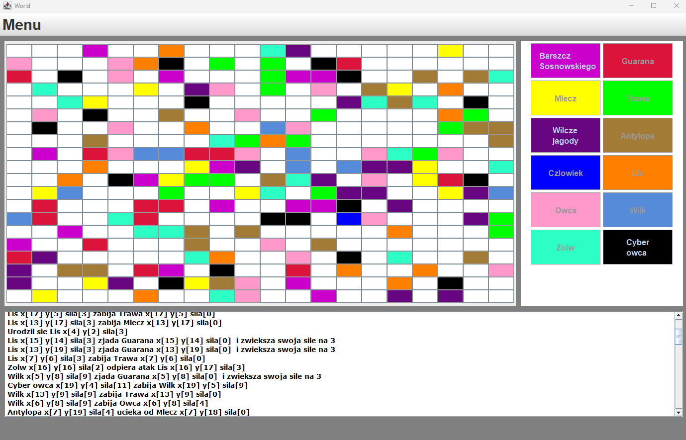
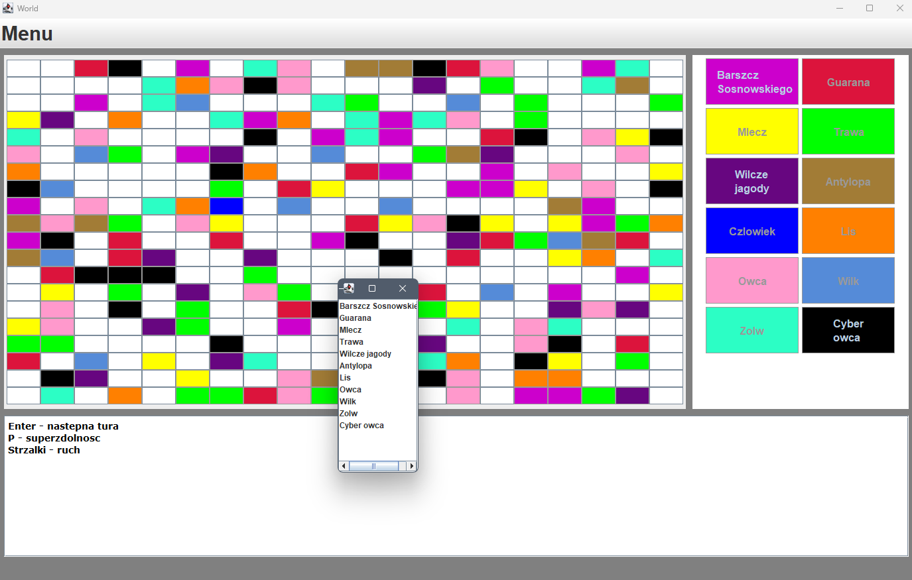

# Life Simulator

    

    

## Description
This project is a graphical user interface (GUI) application for simulating a world populated with various organisms. 
It allows users to create, view, and interact with a virtual world, where organisms can move, interact, and reproduce. 
The application provides a dynamic and interactive environment for visualizing and managing the world simulation.
